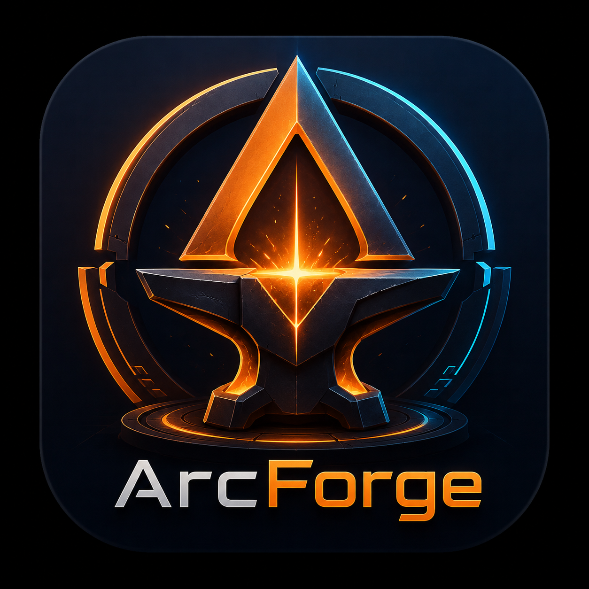

<div align="center">
  
  <h1>Arc<span style="color:#ff8a1a">Forge</span></h1>
  <p>A modular Tauri + Three.js game editor for creating shippable Three.js games.</p>

  <p>
    <strong>ALPHA / WIP:</strong> This project is in early development, very broken, and not production-ready. Use at your own risk.
  </p>

  <p>
    <a href="https://github.com/Vortextbloons/ArcForge/releases"></a>
    <a href="LICENSE"></a>
    
    <a href="https://github.com/Vortextbloons/ArcForge/actions"></a>
  </p>
</div>

---

## Features

- **Visual Scene Editor** — Drag-and-drop entity hierarchy with real-time 3D viewport
- **Component System** — Schema-driven ECS with transform, mesh, physics, scripts, and more
- **Scripting** — TypeScript game scripts with hot-reload and a public runtime API
- **Physics** — Rapier3D integration for rigid bodies, colliders, and joints
- **Export** — Build to standalone Three.js web games or Vite projects
- **MCP Integration** — AI-powered editing via Model Context Protocol tools
- **Cross-Platform** — Windows, macOS, and Linux native desktop apps
- **Auto-Update** — Built-in updater with signed release verification

## Quick Start

### Prerequisites

- [Node.js](https://nodejs.org/) >= 18
- [pnpm](https://pnpm.io/) >= 9
- [Rust](https://www.rust-lang.org/tools/install) stable

### Install

```bash
git clone https://github.com/Vortextbloons/ArcForge.git
cd ArcForge
pnpm install
```

### Development

```bash
pnpm dev:tauri
```

This starts the Vite dev server and launches the Tauri editor window.

### Build

```bash
pnpm tauri build
```

Produces a native installer for your platform in `apps/editor-tauri/src-tauri/target/release/bundle/`.

## Project Structure

```
ArcForge/
├── apps/
│   └── editor-tauri/       # Tauri desktop app (React + Vite)
├── packages/
│   ├── engine/             # Three.js runtime (ECS, scene, physics)
│   ├── editor-core/        # Commands, undo/redo, project model
│   ├── schemas/            # Shared Zod schemas
│   ├── exporter/           # Web & Three.js project export
│   ├── mcp-server/         # AI tools via MCP protocol
│   └── docs-indexer/       # AI docs indexing/search
├── templates/              # Export templates
├── examples/               # Example games
├── plans/                  # Design docs
└── docs/                   # Human & AI documentation
```

## Scripts

| Command           | Description                         |
| ----------------- | ----------------------------------- |
| `pnpm dev`        | Start all packages in watch mode    |
| `pnpm dev:tauri`  | Launch the editor in development    |
| `pnpm build`      | Build all packages                  |
| `pnpm test`       | Run all tests                       |
| `pnpm lint`       | Lint with oxlint                    |
| `pnpm typecheck`  | TypeScript type checking            |
| `pnpm format`     | Format with Prettier                |
| `pnpm export:web` | Export current project as web build |
| `pnpm mcp`        | Start the MCP server standalone     |

## Releasing

Releases are automated via GitHub Actions on version tags:

```bash
# Generate updater signing keys (first time)
pnpm tauri signer generate

# Bump version, tag, and push
git tag v0.2.0
git push origin v0.2.0
```

This triggers the release workflow which builds for all platforms and creates a draft GitHub release with auto-update artifacts.

> **Note:** Set `TAURI_SIGNING_PRIVATE_KEY` and `TAURI_SIGNING_PRIVATE_KEY_PASSWORD` as GitHub repository secrets for signed auto-updates.

## Tech Stack

| Layer         | Technology                                                   |
| ------------- | ------------------------------------------------------------ |
| Desktop Shell | [Tauri v2](https://v2.tauri.app/) (Rust)                     |
| Frontend      | [React](https://react.dev/) + [Vite](https://vite.dev/)      |
| 3D Engine     | [Three.js](https://threejs.org/)                             |
| Physics       | [Rapier3D](https://rapier.rs/)                               |
| Schemas       | [Zod](https://zod.dev/)                                      |
| Monorepo      | [pnpm](https://pnpm.io/) + [Turborepo](https://turbo.build/) |
| AI Layer      | [Model Context Protocol](https://modelcontextprotocol.io/)   |

## License

[MIT](LICENSE)
